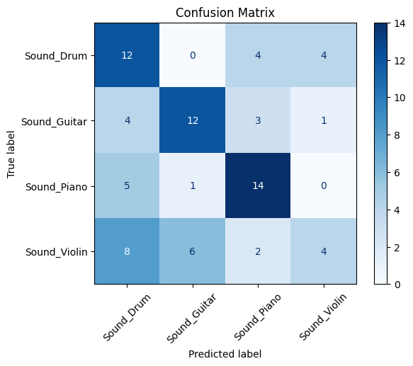
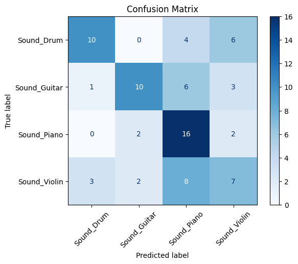
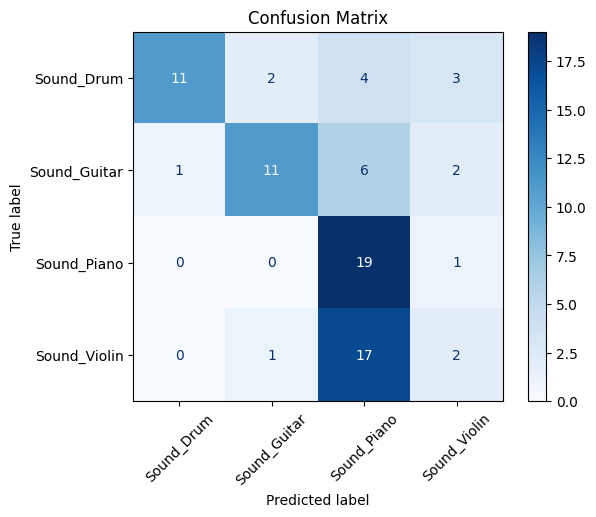
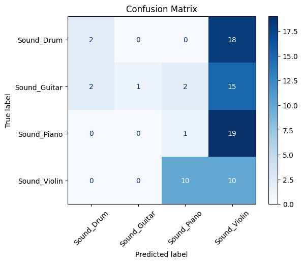
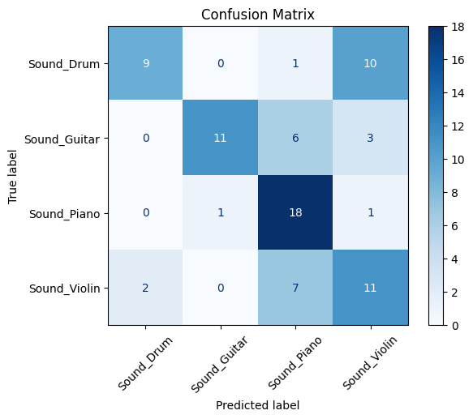

<first>
Objective:
    - Classify audio into [Guitar, Drum, Violin, Piano]

Method:
    - Create spectogram images from audio files
    - Define simple CNN as baseline
    - Train and evaluate

Metrics:
    - Cross-Entropy
    - Accuracy
    - Confusion matrix

Results:
    - Final Acc = 52.5%

</first>

<second>
Objective:
    - Classify audio into [Guitar, Drum, Violin, Piano]

Method:
    - Find the loudest sound on the audio and grab 1s to each direction.

Metrics:
    - Same metrics

Results:
    - Final Acc = 53.75%

</second>

<third>
Objective:
    - Classify audio into [Guitar, Drum, Violin, Piano]

Method:
    - Find the loudest sound on the audio and grab 1s to each direction.
    - Use a pre-trained model as a base model (Efficient Net).

Metrics:
    - Same metrics

Results:
    - Final Acc = 53.75%

</third>

<fourth>
Objective:
    - Classify audio into [Guitar, Drum, Violin, Piano]

Method:
    - Find the loudest sound on the audio and grab 1s to each direction.
    - Use a pre-trained model as a base model (ResNet).
    - Increase Sample Rate

Metrics:
    - Same metrics

Results:
    - Final Acc = 17.50%

</fourth>

<fifth>
Objective:
    - Classify audio into [Guitar, Drum, Violin, Piano]

Method:
    - Find the loudest sound on the audio and grab 1s to each direction.
    - Compute the MFCCs of the sound.
    - Train on a basic CNN.

Metrics:
    - Same metrics

Results:
    - Final Acc = 61.25%

</fifth>